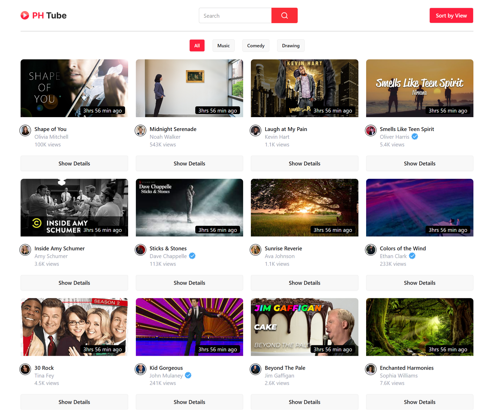

# Project PH-Tube

PH-Tube is a web application that interacts with APIs, displays dynamic data, and includes several key features. Below is an overview of the project.

## Live Demo

You can view the live version of the project here:  
[Live Demo](https://a1shuvo.github.io/ph-tube/)

## Features

- **Load API**: Fetch data from an API and display it dynamically.
- **Display Array of Objects**: Render an array of objects in a user-friendly format.
- **Handle Empty Arrays**: Display a custom message when the array is empty (e.g., "No Content Available").
- **Toggle Active Class**: Highlight which button was clicked by toggling the active class.
- **Conditional Rendering**: Use the ternary operator to conditionally display content based on data or user interactions.
- **Display Data in Modal**: Show detailed information in a modal window when an item is clicked.
- **Search Functionality**: Integrate a search bar to filter data fetched from the API.
- **Loading Spinner**: Display a loading spinner while fetching data from the API.
- **Custom Logic**: Handle custom behavior through JavaScript logic.

## Technologies Used

- **HTML**: The standard markup language for structuring the content of the web.
- **Tailwind CSS**: A utility-first CSS framework for creating custom designs quickly.
- **Daisy UI**: A plugin for Tailwind CSS that provides pre-built components like buttons, modals, and alerts.
- **JavaScript**: A programming language that enables dynamic functionality on the web.

## Screenshot

Here is a screenshot of the project:

